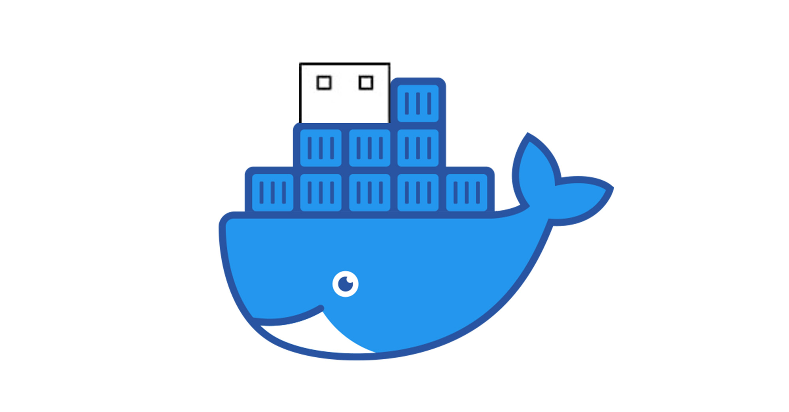

<!-- markdownlint-configure-file { "MD004": { "style": "consistent" } } -->
<!-- markdownlint-disable MD033 -->
#

<p align="center">
  
  <br>
  <strong>Run Ventoy via Docker</strong>
</p>

<!-- markdownlint-enable MD033 -->

VentoyDocker is a project that provides a Docker container allowing you to run [Ventoy](https://www.ventoy.net/) in a Docker environment. 

- **Easy-to-use**: our scripts walk you through the simple use process
- **Free**: open source software that helps you create bootable USB drives
- **Enable Mac Support**: Ventoy officially does not support macOS but VentoyDocker enables Ventoy to work on macOS by using Qemu to emulate the USB drive, allowing you to create bootable USB drives from macOS without needing a physical USB drive.

-----

## Getting Started

### Prerequisites
- Docker installed on your machine
- Qemu installed on your machine (for macOS users)
- A USB drive (or a disk image) to use with Ventoy

### Installation
1. Clone the repository:
   ```bash
   git clone https://github.com/Mr-Sunglasses/VentoyDocker.git
   ```
2. Navigate to the project directory:
   ```bash
   cd VentoyDocker
   ``` 
3. Make the `StartVentoy.sh` and `StartNbd.sh` scripts executable:
   ```bash
   chmod +x StartVentoy.sh
   chmod +x StartNbd.sh
   ``` 
4. Start the NBD server:
   ```bash
   sudo ./StartNbd.sh -d <your-disk-image>
   ```

    - Note: You need to run this command with `sudo` to allow access to the disk image or USB drive.
    - The `-d` option specifies the disk image or USB drive to use with Ventoy.
   - Replace `<your-disk-image>` with the path to your disk image file. If you want to use a USB drive, you can specify the device path (e.g., `/dev/sdb`).

   You can check the available disk images by running:
   ```bash
   diskutil list
   ```

   The default port for NBD is `10809`, but you can specify a different port using the `-p` option:
   ```bash
   ./StartNbd.sh -d <your-disk-image> -p <your-port>
   ```
5. Start the Ventoy Docker container:
   ```bash
   ./StartVentoy.sh
   ```  

6. Steps after starting the container:
   - The script will prompt you to connect to the NBD server from your host machine.
   - Use the command provided to connect to the NBD server:
     ```bash
     nbd-client host.docker.internal <your-nbd-port> <your-nbd-device>
     ```
   - Replace `<your-nbd-port>` with the port you specified (default is `10809`) and `<your-nbd-device>` with the device path (e.g., `/dev/nbd0`).

   - Before exiting the container, cleanly detach NBD, Clean Detach Procedure is essential to avoid data loss: 
        ```bash
        nbd-client -d <your-nbd-port>
        ```

Now you can easily use Ventoy2Disk script to create bootable USB drives or disk images. For more information on how to use Ventoy2Disk script, refer to the [Ventoy documentation](https://www.ventoy.net/en/doc_start.html).

----

### Contributing via GitHub

We welcome _everyone_ to contribute to issue reports, suggest new features, and create pull requests.

If you have something to add - anything from a typo through to a whole new feature, we're happy to check it out! Just make sure to fill out our template when submitting your request; the questions it asks will help the volunteers quickly understand what you're aiming to achieve.

-----

## Authors

- [@Mr-Sunglasses](https://www.github.com/Mr-Sunglasses)

## License

[MIT](https://choosealicense.com/licenses/mit/)

## 💪 Thanks to all Wonderful Contributors

Thanks a lot for spending your time helping bitssh grow.
Thanks a lot! Keep rocking 🍻

[](https://github.com/Mr-Sunglasses/VentoyDocker/graphs/contributors)

## 🙏 Support++

This project needs your shiny star ⭐.
Don't forget to leave a star ⭐️

[](https://forthebadge.com)
